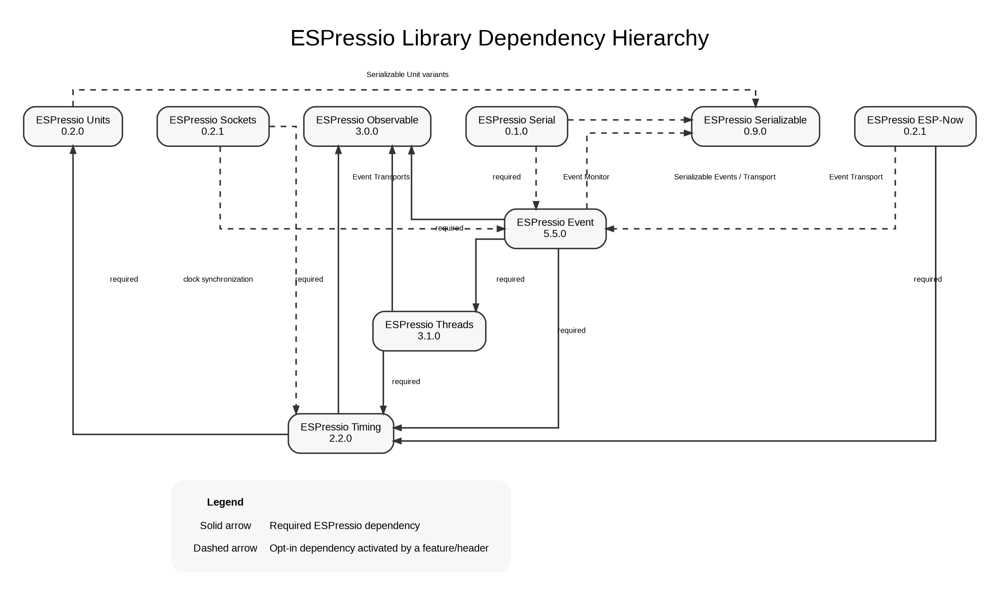

# ESPressio Dependency Chart — Serial 0.5.1



## ESPressio Serial 0.5.1

The Serial core and generic `Console` have no mandatory ESPressio dependencies.
All ESPressio integrations remain opt-in.

### Current integration baselines

```text
CommandConsole / CommandMonitor
    - - -> ESPressio Command >= 0.3.0 < 1.0.0

SecurityMonitor
    - - -> ESPressio Security >= 0.2.0 < 1.0.0

SocketWorkerMonitor
    - - -> ESPressio Sockets >= 0.5.0 < 1.0.0

SocketSecuritySessionMonitor
    - - -> ESPressio Sockets >= 0.5.0 < 1.0.0
    - - -> ESPressio Security >= 0.2.0 < 1.0.0

ESPNowTransportMonitor
    - - -> ESPressio ESP-Now >= 0.5.1 < 1.0.0

SystemClockMonitor
    - - -> ESPressio Timing >= 2.2.3 < 3.0.0

ThreadMonitor
    - - -> ESPressio Threads >= 3.1.3 < 4.0.0

EventMonitor / EventConsole
    - - -> ESPressio Event >= 5.8.1 < 6.0.0
    - - -> ESPressio Serializable >= 0.10.1 < 1.0.0
```

EventMonitor 0.5.1 specifically uses Serializable 0.10.1's bounded,
allocation-free ESPB traversal API for structured diagnostics.

## Current coordinated ecosystem

```text
FOUNDATIONAL
├── Observable 3.0.1
├── Serializable 0.10.1
├── Units 0.2.2
├── Security 0.2.0
└── Command 0.3.0

RUNTIME
└── Timing 2.2.3
    ├── Units >= 0.2.2 < 1.0.0
    └── Observable >= 3.0.1 < 4.0.0

EXECUTION
└── Threads 3.1.3
    ├── Timing >= 2.2.3 < 3.0.0
    └── Observable >= 3.0.1 < 4.0.0

TRANSPORT / INTEGRATION
├── Sockets 0.5.0
└── ESP-Now 0.5.1

EVENT
└── Event 5.8.1
    ├── Threads >= 3.1.3 < 4.0.0
    ├── Timing >= 2.2.3 < 3.0.0
    ├── Observable >= 3.0.1 < 4.0.0
    └── Serializable >= 0.10.1 < 1.0.0 [optional]

DIAGNOSTICS / OPERATOR
└── Serial 0.5.1
```

## Dependency-direction rule

Serial is deliberately a terminal/downstream integration layer. It may observe
or operate against Command, Security, Sockets, ESP-Now, Timing, Threads, Event,
and Serializable, but none of those libraries should acquire a Serial
dependency.

The wider ecosystem should follow the same rule: dependency edges cascade
downstream and integration code belongs with the component that introduces the
additional dependency.

### Known circular optional relationships

Two existing Event bridge placements violate that preferred direction:

```text
Sockets - - -> Event
    concrete socket Event transports

Event - - -> Sockets
    SocketWorkerEventBridge
    SocketSecuritySessionEventBridge
```

and:

```text
ESP-Now - - -> Event
    ESPNowEventTransport

Event - - -> ESP-Now
    ESPNowTransportEventBridge
```

The optimal resolution is to keep Event transport-neutral and relocate the
transport-specific Observer-to-Event bridges downstream into the corresponding
Sockets/ESP-Now Event integration, or into dedicated integration packages.

Generic Event bridges for upstream libraries that do not themselves consume
Event—such as Timing, Threads, Command, and Security—do not create this cycle.

## Why ESP-Now is not pinned to Event 5.8.1

ESP-Now 0.5.1's **required** dependency refresh is Timing 2.2.3. Its Event
transport is optional and can consume a compatible Event 5.x release. Requiring
ESP-Now 0.5.1 to consume Event 5.8.1 while Event also contains an ESP-Now bridge
would strengthen the reciprocal edge and produce unnecessary release churn.

Serial is different: Serial sits downstream of both and therefore validates its
Event integration against Event 5.8.1 and its ESP-Now monitor against ESP-Now
0.5.1.
