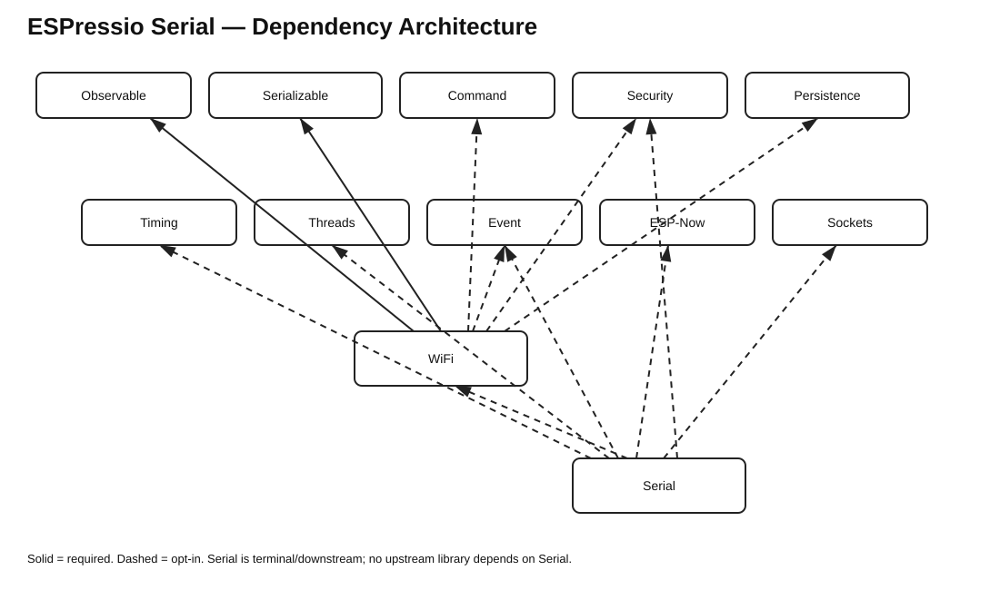

# ESPressio Dependency Chart — Serial 0.6.0



## Serial 0.6.0

The Serial core and generic Console remain free of mandatory ESPressio dependencies. All ecosystem integrations are opt-in.

```text
CommandConsole / CommandMonitor
    - - -> Command >= 0.4.0 < 1.0.0

SecurityMonitor
    - - -> Security >= 0.3.0 < 1.0.0

SocketWorkerMonitor
    - - -> Sockets >= 0.6.0 < 1.0.0

SocketSecuritySessionMonitor
    - - -> Sockets >= 0.6.0 < 1.0.0
    - - -> Security >= 0.3.0 < 1.0.0

ESPNowTransportMonitor
    - - -> ESP-Now >= 0.6.0 < 1.0.0

SystemClockMonitor
    - - -> Timing >= 2.2.4 < 3.0.0

ThreadMonitor
    - - -> Threads >= 3.1.4 < 4.0.0

EventMonitor / EventConsole
    - - -> Event >= 6.0.0 < 7.0.0
    - - -> Serializable >= 0.10.2 < 1.0.0
```

## Final coordinated ecosystem

```text
FOUNDATIONAL
├── Observable 3.0.1
├── Serializable 0.10.2
├── Units 0.2.3
├── Command 0.4.0
└── Security 0.3.0

RUNTIME
└── Timing 2.2.4
    ├── Units
    └── Observable

EXECUTION
└── Threads 3.1.4
    ├── Timing
    └── Observable

EVENT MECHANISM
└── Event 6.0.0
    ├── Threads
    ├── Timing
    ├── Observable
    └── Serializable [optional]

DOMAIN INTEGRATIONS
├── Command 0.4.0 - - -> Event 6.0.0
├── Security 0.3.0 - - -> Event 6.0.0
├── Sockets 0.6.0 - - -> Event 6.0.0
└── ESP-Now 0.6.0 - - -> Event 6.0.0

DIAGNOSTICS / OPERATOR
└── Serial 0.6.0
    - - -> Command 0.4.0
    - - -> Security 0.3.0
    - - -> Sockets 0.6.0
    - - -> ESP-Now 0.6.0
    - - -> Event 6.0.0
    - - -> Timing 2.2.4
    - - -> Threads 3.1.4
    - - -> Serializable 0.10.2
```

## Dependency-direction rule

Serial is deliberately terminal/downstream. It may observe or operate against upstream ESPressio components, but those components must not depend on Serial.

Event 6.0.0 is mechanism-only with respect to Command, Security, Sockets and ESP-Now. Concrete Event adapters live with the domain library that owns the represented concepts. As a result, the coordinated 0.6.0 generation contains no reciprocal Event/domain dependency pair.
